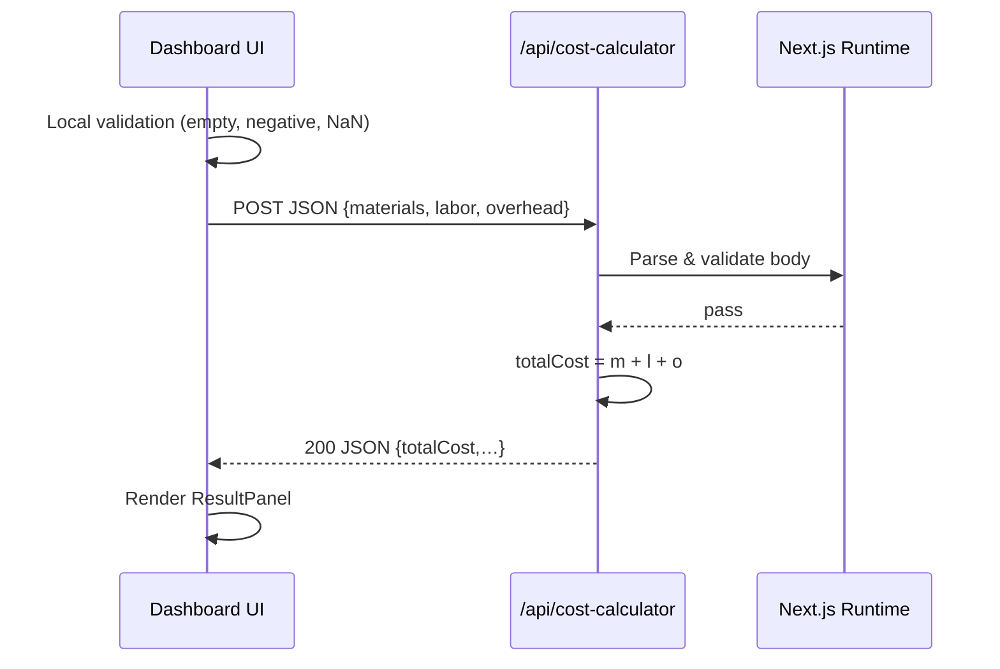

# Cost Calculator – Technical Documentation

_Last updated: 2025-06-09_

## 1 Purpose

The **Cost Calculator** provides engineers and planners with a quick, self-service tool to estimate the **total manufacturing cost** of a production run by summing three inputs:

| Input       | Description                                 | Units |
| ----------- | ------------------------------------------- | ----- |
| `materials` | Direct material expenses (raw goods, parts) | USD   |
| `labor`     | Direct and indirect labor expenses          | USD   |
| `overhead`  | Allocated overhead (energy, tooling, etc.)  | USD   |

The feature is exposed via:

- **REST endpoint** `POST /api/cost-calculator`
- **Dashboard UI** at `/[locale]/dashboard/calculator`

---

## 2 API Specification

### 2.1 Endpoint

```
POST /api/cost-calculator
Content-Type: application/json
```

### 2.2 Request Body

| Field     | Type   | Constraints             |
| --------- | ------ | ----------------------- |
| materials | number | Required, `≥ 0`, finite |
| labor     | number | Required, `≥ 0`, finite |
| overhead  | number | Required, `≥ 0`, finite |

Example:

```json
{
  "materials": 100.25,
  "labor": 80,
  "overhead": 45.75
}
```

### 2.3 Responses

| HTTP | Body schema / Notes                                                                                 |
| ---- | --------------------------------------------------------------------------------------------------- |
| 200  | `{ totalCost:number, breakdown:{materials:number,labor:number,overhead:number}, timestamp:string }` |
| 400  | `{ error:string }` – validation failure, malformed JSON                                             |
| 405  | Method not allowed (App-Router default)                                                             |
| 500+ | Unhandled error (should be caught by Next.js/global error middleware)                               |

_All responses include CORS headers via an `OPTIONS` handler._

#### 2.3.1 Success payload

```json
{
  "totalCost": 226,
  "breakdown": {
    "materials": 100.25,
    "labor": 80,
    "overhead": 45.75
  },
  "timestamp": "2025-06-09T13:37:42.123Z"
}
```

#### 2.3.2 Error payload

```json
{
  "error": "Labor cost must be a valid non-negative number"
}
```

### 2.4 Validation Rules

1. Missing field → `400`
2. `NaN`, `Infinity`, string, negative → `400`
3. Valid numbers are **not** auto-coerced from strings.

### 2.5 OpenAPI Snippet

```yaml
components:
  schemas:
    CostRequest:
      type: object
      required: [materials, labor, overhead]
      properties:
        materials: { type: number, minimum: 0 }
        labor: { type: number, minimum: 0 }
        overhead: { type: number, minimum: 0 }
    CostResponse:
      type: object
      properties:
        totalCost: { type: number }
        breakdown:
          type: object
          properties:
            materials: { type: number }
            labor: { type: number }
            overhead: { type: number }
        timestamp: { type: string, format: date-time }
```

---

## 3 UI Components

| Component                          | File                                         | Description                                            |
| ---------------------------------- | -------------------------------------------- | ------------------------------------------------------ |
| `CalculatorPage`                   | `app/dashboard/[locale]/calculator/page.tsx` | Top-level page (client component).                     |
| `CurrencyInput` _(inline control)_ | part of page                                 | `$` prefixed text input with validation state.         |
| `ResultPanel` _(inline section)_   | part of page                                 | Shows success alert with formatted currency breakdown. |
| `ErrorBanner`                      | part of page                                 | Shows validation or API error as red banner.           |
| `DashboardLayout`                  | `app/dashboard/[locale]/layout.tsx`          | Provides nav & footer, added “Cost Calculator” link.   |
| `currency-formatter.ts`            | `lib/utils/`                                 | Shared utility for parse / format / total helpers.     |

### 3.1 State Model (React)

```ts
interface FormState {
  materials: string; // raw input, kept as string
  labor: string;
  overhead: string;
}
interface UIState {
  isLoading: boolean;
  error: string;
  result: { totalCost: number } | null;
  errors: { materials?: string; labor?: string; overhead?: string };
}
```

### 3.2 i18n Keys

Added under `common.calculator.*` in `public/locales/{en,es}.json`:

- `title`, `materials`, `labor`, `overhead`, `calculate`, `calculating`, `totalCost`, `infoMessage`, plus nested `errors.*`.

---

## 4 Data Flow



_(If validation fails either locally or server-side, an error banner is rendered.)_

---

## 5 Security & Compliance

| Aspect         | Measure                                                                          |
| -------------- | -------------------------------------------------------------------------------- |
| AuthZ          | Page wrapped in dashboard layout → requires active session (middleware).         |
| Input Sanitise | Server rejects non-numeric / negative values, preventing DoS via large integers. |
| CORS           | `OPTIONS` handler permits `*`, configurable later.                               |
| PII            | None collected.                                                                  |

---

## 6 Testing

### 6.1 Unit Tests (`__tests__/api/cost-calculator.test.ts`)

- Success path (positive numbers)
- Zero values
- Missing fields
- Negative / NaN / string values
- Invalid JSON body

### 6.2 Component Tests (TBD)

- Render inputs, perform happy-path calc (mock fetch)
- Client-side validation errors
- API error banner

---

## 7 Future Enhancements

| Category              | Idea                                                                       | Priority |
| --------------------- | -------------------------------------------------------------------------- | -------- |
| **Persistence**       | Save calculation history to Supabase per user; list on dashboard.          | Medium   |
| **Batch Support**     | Add `quantity` & `unitCost` fields; compute batch vs unit costs.           | Medium   |
| **Advanced Overhead** | Allow %-based overhead, multi-line items (energy, tooling, QA).            | Low      |
| **Currency Options**  | Let user select currency & locale; auto format in UI and API response.     | Low      |
| **Charts**            | Show pie / bar charts of cost breakdown (d3.js or Recharts).               | Low      |
| **Scenario Compare**  | Compare multiple scenarios side-by-side; export to CSV/PDF.                | Low      |
| **API Rate Limits**   | Add middleware for throttling to prevent abuse.                            | Low      |
| **Integration Hooks** | Emit event (`cost.calculated`) on message bus for downstream MES/ERP sync. | Medium   |

---

## 8 Implementation Notes

- **Framework**: Next.js 14 App Router, React 18, TS strict mode.
- **Styling**: Tailwind CSS, re-uses dashboard palette.
- **Error Handling**: API returns early on first invalid field to minimise response payload.
- **Timestamp**: ISO-8601 to support cross-system logging.

---

## 9 Changelog

| Date       | Author     | Notes                                  |
| ---------- | ---------- | -------------------------------------- |
| 2025-06-09 | AI Factory | Initial feature documentation created. |
